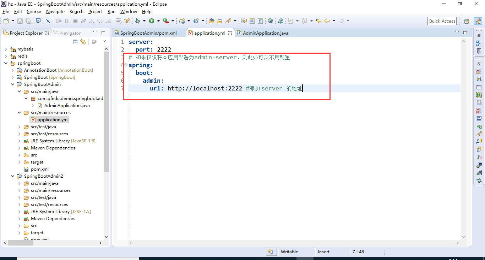
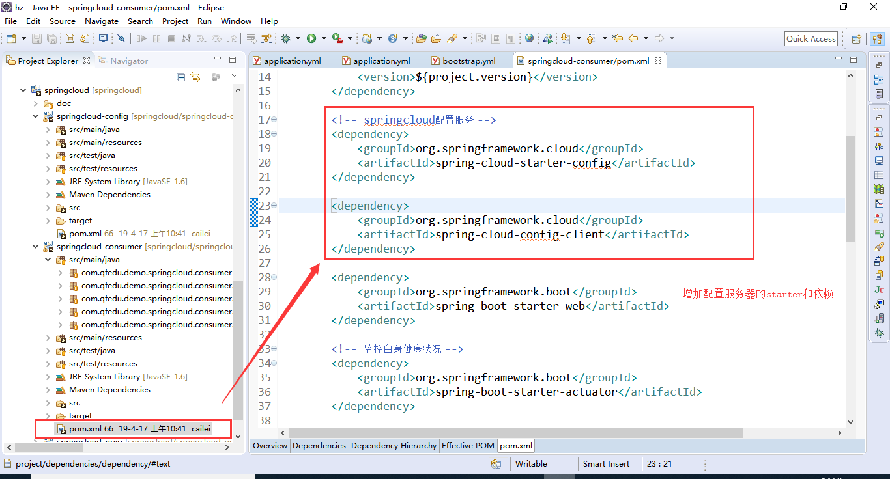
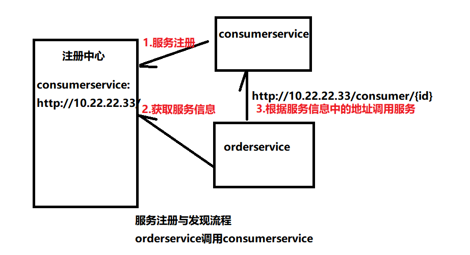
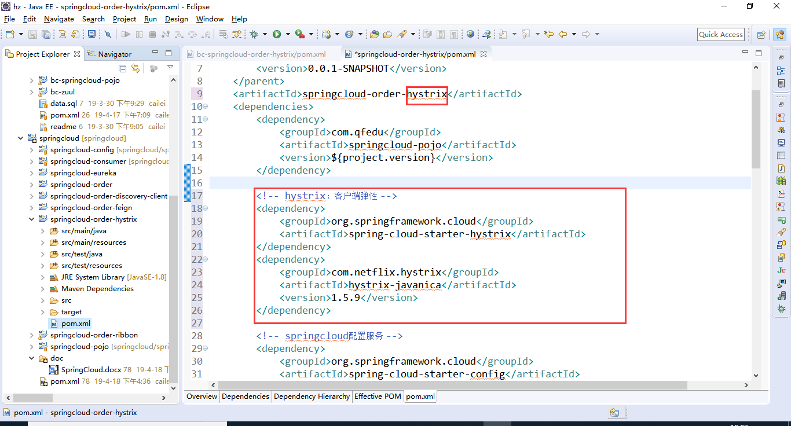

SpringCloud
[TOC]
# 1.微服务环境下物理架构

在微服务架构中，首先，项目要拆分为多个微服务，每个微服务发布时，又会部署为多个实例。从而形成大量微服务实例。
实例的管理
配置的管理
服务之间的访问

采用admin-server来管理上述大量的微服务实例。
采用配置服务器，统一管理配置文件，所有微服务从配置服务器上获取其配置，其自身不再需要配置。

# 2.AdminServer
管理所有springboot应用实例，并提供图形化界面显示其状态和参数，方便运维管理。

## 2.1.创建maven项目

/SpringBootAdmin

### 2.1.1.配置pom
如果仅仅在eclipse等工具中启动adminserver，则仅需要如下依赖即可

如果要打包jar，则需要

### 2.1.2.配置spring
/SpringBootAdmin/src/main/resources/application.yml

### 2.1.3.启动类
/SpringBootAdmin/src/main/java/com/qfedu/demo/springboot/admin/AdminApplication.java

## 2.2.Adminserver监控自己的应用
将本项目作为一个微服务实例，纳入adminserver的管理，也就是说，adminserver既当管理者，也作为被管理对象。
下面配置，可以将某个springboot应用纳入adminserver的管理。
### 2.2.1.配置pom

### 2.2.2.配置spring

## 2.3.测试

## 2.4.了解actuator
Adminserver引入了依赖actuator

其作用是，将springboot应用的信息通过/health暴露出来

# 3.配置服务器
## 3.1.创建项目
### 3.1.1.创建父项目SpringCloud
### 3.1.2.创建pojo项目
Consumer
Orders
### 3.1.3.创建Consumer项目
根据id获取客户信息
URL：/consumer/{id}
返回：{"id":"1","name":"张三"}
所有配置在本地。

### 3.1.4.创建子项目ConfigServer
## 3.2.将consumer项目的配置放到配置服务器
### 3.2.1.配置配置服务器
/springcloud-config/pom.xml

### 3.2.2.启动类

### 3.2.3.配置spring
#### 3.2.3.1.配置bootstrap.xml

#### 3.2.3.2.配置application.yml

searchLocations配置各个项目的配置文件的搜索路径
### 3.2.4.拷贝consumer项目的配置

### 3.2.5.配置consumer项目
参考上节，需要新建一个bootstrap.xml配置：

配置pom.xml

## 3.3.测试
首先启动配置服务器，然后启动consumerservice项目
### 3.3.1.查看配置服务器的配置
http://localhost:8888/env

### 3.3.2.查看consumerservice的配置
http://localhost:8888/consumerservice/default
其内容对应：
/springcloud-config/src/main/resources/config/consumerservice/consumerservice.yml

http://localhost:8888/consumerservice/dev
其内容对应：
/springcloud-config/src/main/resources/config/consumerservice/consumerservice-dev.yml

### 3.3.3.测试consumerservice

# 4.服务注册与发现

Springcloud采用Netflix开发eureka作为注册中心。

## 4.1.启动eureka服务器
### 4.1.1.创建项目
#### 4.1.1.1.配置pom

#### 4.1.1.2.配置spring
/springcloud-eureka/src/main/resources/application.yml

#### 4.1.1.3.启动类
/springcloud-eureka/src/main/java/com/qfedu/demo/springcloud/eureka/EurekaApplication.java

## 4.2.服务注册
改造consumerservice使其可以在注册中心注册
### 4.2.1.在配置服务器项目中修改配置
/springcloud-config/src/main/resources/config/consumerservice/consumerservice.yml

### 4.2.2.配置pom
/springcloud-consumer/pom.xml

### 4.2.3.启动类
/springcloud-consumer/src/main/java/com/qfedu/demo/springcloud/consumer/ConsumerApplication.java

### 4.2.4.测试服务注册
启动配置服务器
启动eureka
启动consumerservice
访问http://localhost:8761/eureka/apps/
即可查看eureka上已经注册的服务

访问http://localhost:8761/eureka/apps/consumerservice
即可查看已经注册的consumerservice服务

## 4.3.使用adminserver监控eureka中的服务
将adminserver注册到eureka中即可。
### 4.3.1.注册adminserver
#### 4.3.1.1.配置pom
/SpringBootAdmin/pom.xml

#### 4.3.1.2.配置spring
/SpringBootAdmin/src/main/resources/application.yml

#### 4.3.1.3.启动类
/SpringBootAdmin/src/main/java/com/qfedu/demo/springboot/admin/AdminApplication.java

## 4.4.服务发现-EurekaClient
完成订单微服务，提供/order/{id}接口，最终返回包括客户信息的订单数据。
根据订单id，到数据库查询订单数据；
根据订单中的客户id，调用客户微服务，获取客户信息，然后返回。

### 4.4.1.在配置服务器中增加orderservice的配置
/springcloud-config/src/main/resources/application.yml

/springcloud-config/src/main/resources/config/orderservice/orderservice.yml

### 4.4.2.增加订单实体类

### 4.4.3.创建订单项目
#### 4.4.3.1.配置pom
/springcloud-order/pom.xml

#### 4.4.3.2.配置spring
/springcloud-order/src/main/resources/bootstrap.yml

#### 4.4.3.3.启动类
/springcloud-order/src/main/java/com/qfedu/demo/springcloud/order/OrderApplication.java

#### 4.4.3.4.Controller

#### 4.4.3.5.Service
/springcloud-order/src/main/java/com/qfedu/demo/springcloud/order/service/impl/OrderServiceImpl.java

#### 4.4.3.6.Mapper
/springcloud-order/src/main/java/com/qfedu/demo/springcloud/order/mapper/OrderMapper.java
/springcloud-order/src/main/resources/mapper/OrderMapper.xml

### 4.4.4.测试
启动配置服务器
启动注册中心
启动客户服务
启动订单服务OrderApplication
测试客户服务：

测试订单服务：

## 4.5.总结
### 4.5.1.客户服务启动流程

### 4.5.2.订单服务调用流程

# 5.服务发现-DiscoveryClient
## 5.1.创建新的订单项目
项目名称：/springcloud-order-discovery-client
拷贝/springcloud-order项目的代码和配置
### 5.1.1.修改pom
/springcloud-order-discovery-client/pom.xml

### 5.1.2.修改启动类
/springcloud-order-discovery-client/src/main/java/com/qfedu/demo/springcloud/order/OrderDiscoveryClientApplication.java

## 5.2.修改Service
/springcloud-order-discovery-client/src/main/java/com/qfedu/demo/springcloud/order/service/impl/OrderServiceImpl.java

## 5.3.测试
启动配置服务器
启动注册中心
启动客户服务
启动订单服务OrderDiscoveryClientApplication
测试客户服务：

测试订单服务：

# 6.客户端负载均衡
## 6.1.创建新的订单项目
项目名称：/springcloud-order-ribbon
拷贝/springcloud-order项目的代码和配置
### 6.1.1.修改pom
/springcloud-order-ribbon/pom.xml

### 6.1.2.修改启动类
/springcloud-order-ribbon/src/main/java/com/qfedu/demo/springcloud/order/OrderRibbonApplication.java
@LoadBalaced表示采用ribbon做客户端负载均衡zu

## 6.2.改造service
/springcloud-order-ribbon/src/main/java/com/qfedu/demo/springcloud/order/service/impl/OrderServiceImpl.java

## 6.3.测试
启动配置服务器
启动注册中心
启动客户服务
启动订单服务OrderRibbonApplication
测试客户服务：

测试订单服务：

## 6.4.总结
### 6.4.1.订单服务请求流程

### 6.4.2.客户端和服务端负载均衡

客户端负载均衡：请求方和代理在一个进程中
服务端负载均衡：请求放和代理分别是不同的服务器

### 6.4.3.总体架构图

# 7.服务发现-Feign
声明式负载均衡（服务发现）
## 7.1.创建新的订单项目
项目名称：/springcloud-order-feign
拷贝/springcloud-order项目的代码和配置
### 7.1.1.修改pom
/springcloud-order-feign/pom.xml

### 7.1.2.修改启动类
/springcloud-order-feign/src/main/java/com/qfedu/demo/springcloud/order/OrderFeignApplication.java

## 7.2.改造service
/springcloud-order-feign/src/main/java/com/qfedu/demo/springcloud/order/service/impl/OrderServiceImpl.java
/springcloud-order-feign/src/main/java/com/qfedu/demo/springcloud/order/service/client/ConsumerFeignClient.java

## 7.3.测试
启动配置服务器
启动注册中心
启动客户服务
启动订单服务OrderFeignApplication
测试客户服务：

测试订单服务：

# 8.客户端弹性策略-hystrix
雪崩效应：某个服务的性能问题，传播到整个系统，导致整个系统崩溃。

客户端弹性
服务降级：服务B调用服务A，当发现A已经死亡或者性能有问题，采用备选方案，暂时不去调用服务A。过段时间再重新尝试调用。
服务降级如果没有备选方案，则这种模型为断路器（服务熔断）。
服务降级和统一异常处理的区别：
当服务调用出现异常或者响应较慢时，采用备选方案；
统一异常处理，是当controller抛出异常时，执行指定的代码。

服务降级或者熔断，不一定仅仅应用在远程服务调用，也可以应用在本地资源调用（数据库）。

## 8.1.概念
雪崩效应
客户端弹性：当服务调用出现异常或者响应较慢时，采用一定的方案
服务降级（后备） 、断路器（服务熔断）、舱壁（隔离）
## 8.2.创建新的订单项目
项目名称：/springcloud-order-hystrix
拷贝/springcloud-order-ribbon项目的代码和配置
### 8.2.1.修改pom
/springcloud-order-hystrix/pom.xml

### 8.2.2.修改启动类
/springcloud-order-hystrix/src/main/java/com/qfedu/demo/springcloud/order/OrderHystrixApplication.java

## 8.3.服务降级（后备）
### 8.3.1.改造controller
/springcloud-order-hystrix/src/main/java/com/qfedu/demo/springcloud/order/controller/OrderController.java

### 8.3.2.测试
启动配置服务器
启动注册中心
启动客户服务
启动订单服务OrderHystrixApplication
测试订单服务：

停止客户服务，继续调用订单服务

### 8.3.3.总结

## 8.4.断路器（服务熔断）
### 8.4.1.修改Controller
/springcloud-order-hystrix/src/main/java/com/qfedu/demo/springcloud/order/controller/OrderController.java
随机sleep三秒（不是必须）。

### 8.4.2.客户端弹性超时时间设置
如果需要修改客户端弹性的超时时间，则进行如下设置：
execution.isolation.thread.timeoutInMilliseconds

### 8.4.3.测试
启动配置服务器
启动注册中心
启动客户服务
启动订单服务OrderHystrixApplication
测试订单服务：
随机出现下面两个结果之一：
#### 8.4.3.1.抛出异常
com.netflix.hystrix.exception.HystrixRuntimeException

#### 8.4.3.2.正常返回

## 8.5.舱壁模式（隔离）
在默认情况下，当请求微服务接口时，hystrix会启动一个线程池，来处理并发的请求。
当高并发发生时，由于响应较慢的接口和响应较快的接口公用同一个线程池，从而导致慢接口会更多的占用线程，而快接口无线程可用，从而拖垮快接口。

此时，可以采用舱壁模式，给慢接口设置单独的线程池，从而隔离它。

# 9.客户端弹性策略-feign+hystrix
## 9.1.创建新的订单项目
项目名称：/springcloud-order-feign-hystrix
拷贝项目/springcloud-order-feign的代码和配置

## 9.2.修改Feign接口

## 9.3.测试
启动配置服务器
启动注册中心
启动客户服务
启动订单服务OrderFeignHystrixApplication
测试订单服务：

停止客户服务，继续调用订单服务

# 10.服务路由

Zuul充当服务路由器的作用，将服务请求反向代理到实际的服务上，实现服务端负载均衡；
因为所有的服务调用都要通过Zuul，所以可以用它来完成日志和服务跟踪。

## 10.1.启动zuul服务器

### 10.1.1.创建项目
/springcloud-zuul
### 10.1.2.配置pom
/springcloud-zuul/pom.xml

### 10.1.3.配置启动类
/springcloud-zuul/src/main/java/com/qfedu/demo/springcloud/zuul/ZuulApplication.java

### 10.1.4.配置bootstrap.xml
/springcloud-zuul/src/main/resources/bootstrap.yml

### 10.1.5.在配置服务器上配置spring配置
#### 10.1.5.1.配置zuulservice.yml
/springcloud-config/src/main/resources/config/zuulservice/zuulservice.yml

#### 10.1.5.2.配置搜索路径
/springcloud-config/src/main/resources/application.yml

## 10.2.创建新的订单项目
项目名称：/springcloud-order-zuul
拷贝项目/springcloud-order-ribbon的代码和配置
## 10.3.自动路由
### 10.3.1.修改Service
/springcloud-order-zuul/src/main/java/com/qfedu/demo/springcloud/order/service/impl/OrderServiceImpl.java

### 10.3.2.测试
启动配置服务器
启动eureka服务器
启动zuul服务器
启动客户服务器
启动订单服务器OrderZuulApplication

### 10.3.3.总结

## 10.4.手动路由
### 10.4.1.配置
/springcloud-config/src/main/resources/config/zuulservice/zuulservice.yml

### 10.4.2.Service
/springcloud-order-zuul/src/main/java/com/qfedu/demo/springcloud/order/service/impl/OrderServiceImpl.java

### 10.4.3.测试
启动配置服务器
启动eureka服务器
启动zuul服务器
启动客户服务器
启动订单服务器OrderZuulApplication

### 10.4.4.总结

## 10.5.静态路由
### 10.5.1.配置和Service修改
/springcloud-config/src/main/resources/config/zuulservice/zuulservice.yml
/springcloud-order-zuul/src/main/java/com/qfedu/demo/springcloud/order/service/impl/OrderServiceImpl.java

### 10.5.2.测试
启动配置服务器
启动eureka服务器
启动zuul服务器
启动客户服务器
启动订单服务器OrderZuulApplication

### 10.5.3.总结

## 10.6.服务路由api
/springcloud-config/src/main/resources/config/zuulservice/zuulservice.yml
/springcloud-order-zuul/src/main/java/com/qfedu/demo/springcloud/order/service/impl/OrderServiceImpl.java

